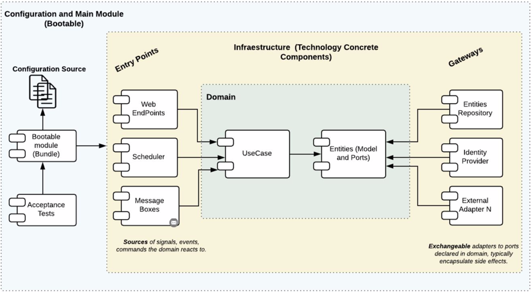
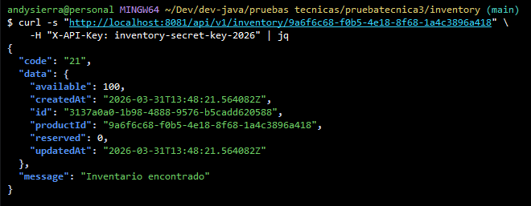
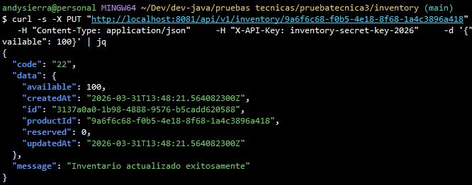
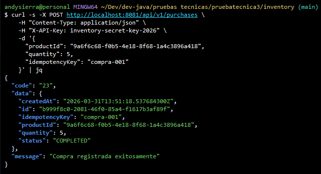
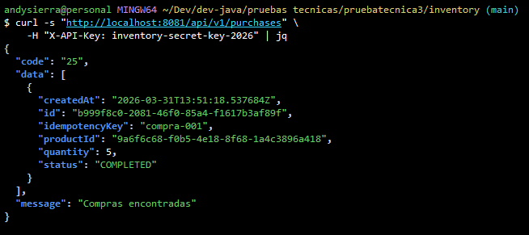

# Inventory & Products Microservices

API RESTful reactiva compuesta por dos microservicios desacoplados para
la gestión de productos e inventario, implementados con Spring Boot
WebFlux y arquitectura hexagonal.

------------------------------------------------------------------------

## Arquitectura Hexagonal (Puertos y Adaptadores)

```
                    +--------------------------------------+
                    |           APPLICATION                |
                    |  (Ensamblaje, configuracion, beans)  |
                    |  ApiKeyFilter, RateLimitFilter,      |
                    |  CorrelationIdFilter, Flyway         |
                    +-----------------+--------------------+
                                      |
          +---------------------------+---------------------------+
          |                           |                           |
 +--------v---------+      +---------v----------+      +---------v--------+
 |   ENTRY POINTS    |      |      DOMAIN        |      | DRIVEN ADAPTERS  |
 |  (reactive-web)   |      |                    |      | (r2dbc-postgres) |
 |                   |      |  +==============+  |      |                  |
 |  Handler          |----->|  |  Use Cases   |  |<-----|  ProductRepo     |
 |  RouterRest       |      |  |              |  |      |    Adapter       |
 |  ResponseBuilder  |      |  +------+-------+  |      |                  |
 |  RestValidator    |      |         |          |      |  ProductEntity   |
 |  Mapper           |      |  +------v-------+  |      |  DatabaseClient  |
 |                   |      |  |   Models     |  |      |  ConnectionPool  |
 |  Requests/        |      |  |   Gateways   |  |      |                  |
 |  Responses        |      |  |   Enums      |  |      |                  |
 +---------+---------+      +--------+--------+  |      +------------------+
                            +--------------------+
```


------------------------------------------------------------------------

## Stack Tecnológico

-   **Java 21**
-   **Spring Boot (WebFlux - Reactivo)**
-   **R2DBC + PostgreSQL 16**
-   **Flyway (migraciones)**
-   **Resilience4j (Retry, Circuit Breaker, Timeout)**
-   **Gradle**
-   **JUnit 5 + Mockito + StepVerifier**
-   **Docker + Docker Compose**
-   **Micrometer + Prometheus**
-   **Log4j2 (logs estructurados JSON)**

------------------------------------------------------------------------

## Arquitectura

Arquitectura basada en **Hexagonal (Ports & Adapters)**:

-   **Domain:** lógica de negocio pura
-   **Use Cases:** orquestación de reglas
-   **Entry Points:** API REST (WebFlux)
-   **Driven Adapters:** persistencia (PostgreSQL) y consumo HTTP

------------------------------------------------------------------------

## Servicios

### Products Service (Puerto 8080)

Responsable de la gestión de productos:

-   CRUD completo
-   Validación de SKU único
-   Paginación, filtros y ordenamiento
-   Manejo de errores estandarizado `{code, message, data}`

------------------------------------------------------------------------

### Inventory Service (Puerto 8081)

Responsable de inventario y compras:

-   Consulta e inicialización de stock
-   Registro de compras
-   Idempotencia mediante `idempotencyKey`
-   Control de concurrencia con **optimistic locking**
-   Comunicación resiliente con Products Service

------------------------------------------------------------------------

## Seguridad

-   **API Key** obligatoria en `/api/**`
-   **Rate limiting** por IP
-   **CORS configurable**
-   **Correlation ID** para trazabilidad

------------------------------------------------------------------------

## Variables de Entorno

### Comunes

  Variable      Default
  ------------- -----------
  DB_HOST       localhost
  DB_PORT       5432
  DB_NAME       store_db
  DB_USER       admin
  DB_PASSWORD   admin

### Products

  Variable   Default
  ---------- --------------------------
  API_KEY    products-secret-key-2026

### Inventory

  Variable               Default
  ---------------------- ---------------------------
  API_KEY                inventory-secret-key-2026
  PRODUCTS_SERVICE_URL   http://localhost:8080
  PRODUCTS_API_KEY       products-secret-key-2026

------------------------------------------------------------------------

## Ejecución

### Docker Compose

``` bash
docker compose up -d
```

------------------------------------------------------------------------

## API Endpoints y cURLs

## Products Service

### 1. Crear Producto
`POST /api/v1/products`

```bash
curl -s -X POST http://localhost:8080/api/v1/products \
  -H "Content-Type: application/json" \
  -H "X-API-Key: products-secret-key-2026" \
  -d '{
    "sku": "SKU-001",
    "name": "Laptop Gamer Pro",
    "price": 2999.99
  }' | jq
```

### 2. Listar Productos
`GET /api/v1/products`

```bash
curl -s "http://localhost:8080/api/v1/products" \
  -H "X-API-Key: products-secret-key-2026" | jq
```

Con filtros:
```bash
curl -s "http://localhost:8080/api/v1/products?status=ACTIVE&search=laptop&sortBy=price&sortDir=asc&page=0&size=5" \
  -H "X-API-Key: products-secret-key-2026" | jq
```

### 3. Consultar Producto
`GET /api/v1/products/{id}`

```bash
curl -s "http://localhost:8080/api/v1/products/{UUID}" \
  -H "X-API-Key: products-secret-key-2026" | jq
```

### 4. Actualizar Producto
`PUT /api/v1/products/{id}`

```bash
curl -s -X PUT "http://localhost:8080/api/v1/products/{UUID}" \
  -H "Content-Type: application/json" \
  -H "X-API-Key: products-secret-key-2026" \
  -d '{
    "name": "Laptop Gamer Pro Max",
    "price": 3499.99
  }' | jq
```

### 5. Eliminar Producto
`DELETE /api/v1/products/{id}`

```bash
curl -s -X DELETE "http://localhost:8080/api/v1/products/{UUID}" \
  -H "X-API-Key: products-secret-key-2026" | jq
```

### 6. Health Check (sin API Key)
`GET /actuator/health`

```bash
curl -s http://localhost:8080/actuator/health | jq
```

------------------------------------------------------------------------

## Inventory Service

### Inicializar stock

Todas las peticiones a `/api/**` requieren el header `X-API-Key`.

### 1. Consultar Inventario
`GET /api/v1/inventory/{productId}`

```bash
curl -s "http://localhost:8081/api/v1/inventory/{PRODUCT_UUID}" \
  -H "X-API-Key: inventory-secret-key-2026" | jq
```


### 2. Inicializar/Actualizar Stock
`PUT /api/v1/inventory/{productId}`

```bash
curl -s -X PUT "http://localhost:8081/api/v1/inventory/{PRODUCT_UUID}" \
  -H "Content-Type: application/json" \
  -H "X-API-Key: inventory-secret-key-2026" \
  -d '{"available": 100}' | jq
```


### 3. Crear Compra
`POST /api/v1/purchases`

```bash
curl -s -X POST http://localhost:8081/api/v1/purchases \
  -H "Content-Type: application/json" \
  -H "X-API-Key: inventory-secret-key-2026" \
  -d '{
    "productId": "{PRODUCT_UUID}",
    "quantity": 5,
    "idempotencyKey": "purchase-001"
  }' | jq
```


### 4. Consultar Compra
`GET /api/v1/purchases/{id}`

```bash
curl -s "http://localhost:8081/api/v1/purchases/{PURCHASE_UUID}" \
  -H "X-API-Key: inventory-secret-key-2026" | jq
```

### 5. Listar Compras
`GET /api/v1/purchases`

```bash
curl -s "http://localhost:8081/api/v1/purchases?page=0&size=10" \
  -H "X-API-Key: inventory-secret-key-2026" | jq
```


Con filtro por producto:
```bash
curl -s "http://localhost:8081/api/v1/purchases?productId={PRODUCT_UUID}" \
  -H "X-API-Key: inventory-secret-key-2026" | jq
```

### 6. Health Check (sin API Key)
```bash
curl -s http://localhost:8081/actuator/health | jq
```

------------------------------------------------------------------------

## Concurrencia

Se implementa **optimistic locking** con campo `version` para evitar
condiciones de carrera:

-   Dos compras simultáneas no pueden generar stock negativo
-   Si hay conflicto → error 409

------------------------------------------------------------------------

## Resiliencia

Comunicación Inventory → Products protegida con:

-   **Timeout**
-   **Retry**
-   **Circuit Breaker**

Fallback: - Si Products falla → error 503 controlado

------------------------------------------------------------------------

## Observabilidad

-   Logs estructurados (JSON)
-   Correlation ID en headers
-   Métricas Prometheus `/actuator/prometheus`
-   Health checks `/actuator/health`

------------------------------------------------------------------------

## Calidad

-   Validaciones con Bean Validation
-   Manejo de errores consistente
-   Separación de capas clara
-   Tests unitarios y de integración

------------------------------------------------------------------------

Made with <3 by Andres Sierra
